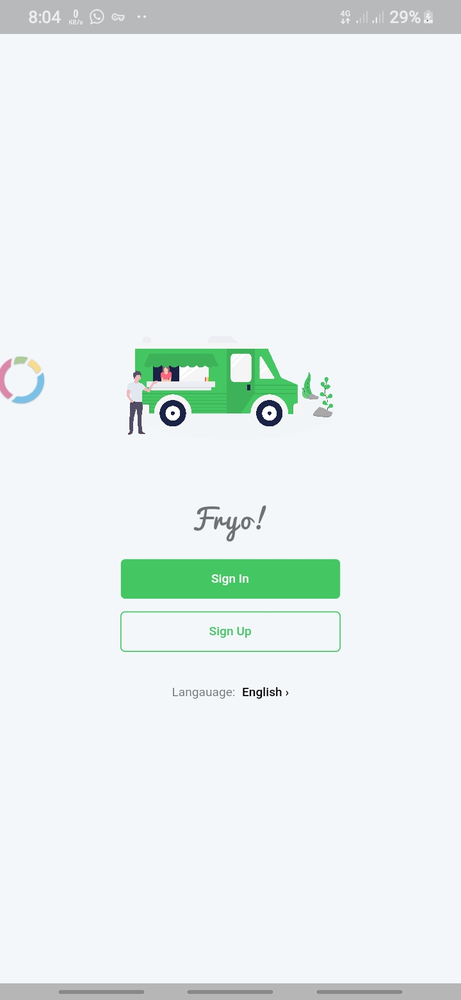
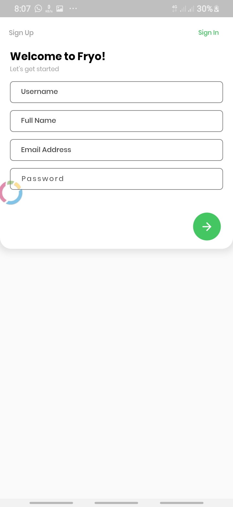

# 🍔😋 H-Mart 

#  Screenshots

| 1 | 2|
|------|-------|
|||

# ✨ Requirements
- Any Operating System (ie. MacOS X, Linux, Windows)
- Any IDE with Flutter SDK installed (ie. IntelliJ, Android Studio, VSCode etc)
- A little knowledge of Dart and Flutter
- Some fingers to code 😂
 
# Getting Started

For help getting started with Flutter, view our 
[online documentation](https://flutter.io/docs), which offers tutorials, 
samples, guidance on mobile development, and a full API reference.

